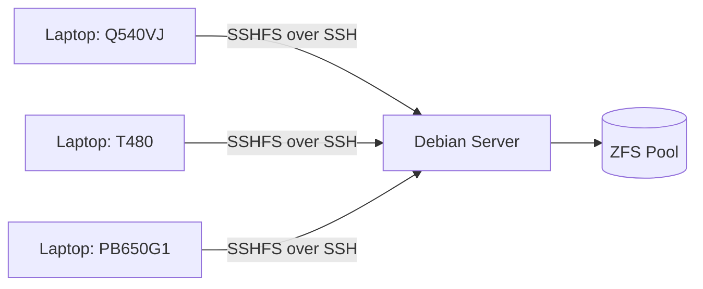

# cloud-project
During the Spring '26 semester, I took an EEP wherein I worked on one major project, and two sub-projects. This is the main project that I worked on.
This will serve as the writeup for the project, as well as the long version of what my site contains. 
this formatting is subject to change, i'm just trying to get a general idea down for now

---

## TLDR
I built a personal cloud server that I could access from anywhere in part to decentralize from services providers; and also to measure how usable older hardware is. It's built on Debian Linux, and uses in particular SSH, SSHFS, and ZFS. 
As somebody that likes to use older laptops, one of the main goals was to measure the R/W speeds across different Wi-Fi versions, specifically 4, 5, and 6E. To do so, I set up three different laptops, recorded bandwidth across 10 read and 10 write tests each using `fio`, and parsed the data using Python. Within the [main script](main.py), I used [pandas](https://pandas.pydata.org/) to read and process data, and [matplotlib](https://matplotlib.org/) to visualize the dataset.   

---

## Project Goals
The goals that I had are three-fold:
1. Disconnect from large service providers
2. Learn and apply server access and networking fundamentals
3. Study the speeds of cloud reading and writing across Wi-Fi protocols

All of which, I will go into more detail on below.

#### 1. Disconnect from Large Service Providers
This was mostly a pre-project motivator which was a similar reason to my migration to using Linux as my main OS, or choosing to selfhost more services. This is kind of an initial motivator that gets me to look into something that somebody might not normally consider, and in this case, was self-hosting my own data cloud.

#### 2. Learn and apply server access and networking fundamentals
Because of my rise in interest in self-hosting, one of the things that motivated me to work on this project is that I would learn some of the key fundamentals of networking and how I might apply them. For example, I had to study why using something like [tailscale](https://tailscale.com/) might not work when the client is using an enterprise symmetrical NAT to access data from a server. Learning and applying such things would give me first-hand experience with some of the most important tools in relation to servers, as well as a gateway to studying how clouds work.

#### 3. Study the speeds of cloud reading and writing across Wi-Fi protocols
I'm somebody that has an appreciation for older hardware. I may have a Raptorlake laptop on my desk, but I often find myself leaning towards older laptops. My college laptop (at the time of writing this) is a Thinkpad T480, which is for the most part a cult classic among Thinkpads. While these can be upgraded to something like Wi-Fi 6E thanks to the M.2 keyed wifi cards, if we were to go a little older, say, the Thinkpad T430, that uses a Mini-PCIE keyed Wi-Fi card, a form factor that the computer industry has broadly abandoned. 
But beyond my tendency towards older tech, it's not easy to compare Wi-Fi version capabilities since we often measure them by the maximum up/down, which realistically almost never happens with a wireless network. A visualized comparison derived from a real use case is a much more realistic metric that the consumer would be affected by. 

---

## Architecture
this is a base for mermaid, i'll have to learn to use this, or at least learn the basics

---
## Challenges
### Accessing the Server
This was the largest issue that I've had during the project itself. During the beginning of the project, my core objection was to leave port 22 alone such that the server would be privately accessible through a VPN, and only accessible through a VPN. 
The first attempt was to use Tailscale (use hyperlink), an extremely easy to use VPN service where you can access another machine on the same tailnet. 
The second attempt was to use cloudflared (use hyperlink)
The last attempt, and ultimately the solution, was to just open port 22.

---

## Niche Issues
MullvadVPN, slows stuff. Maybe I get rid of this. Not sure. 

